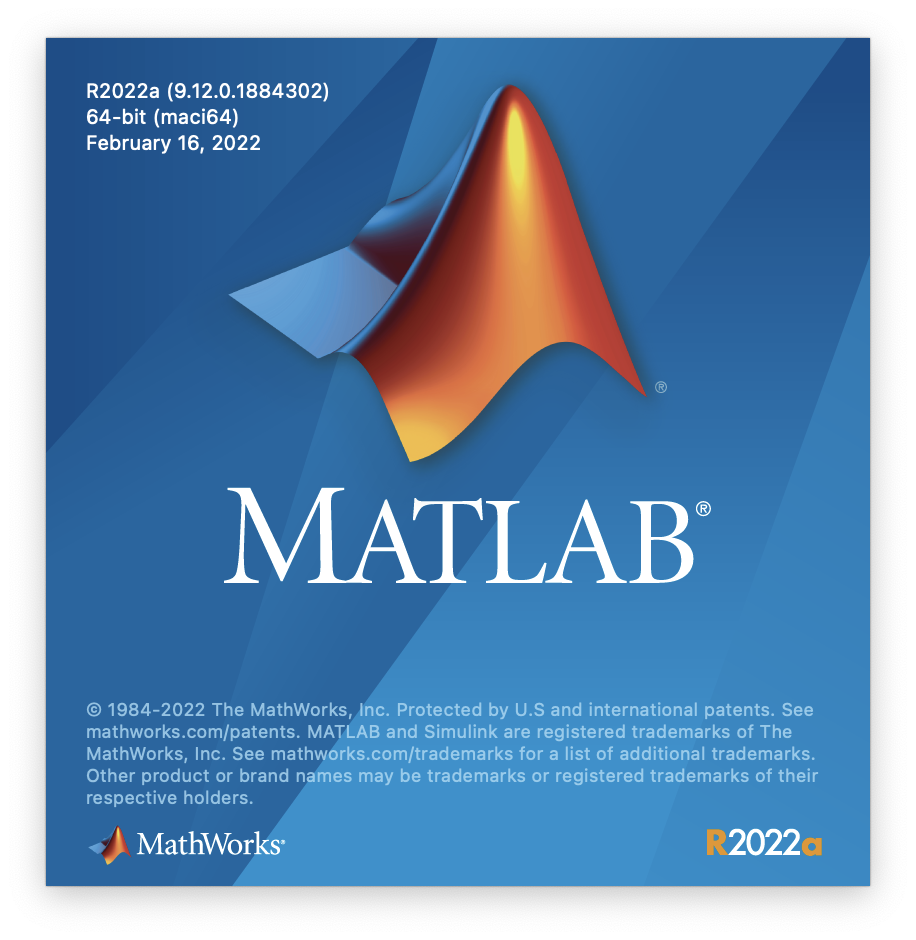
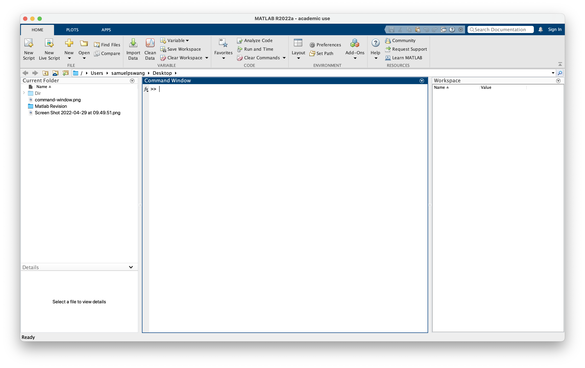
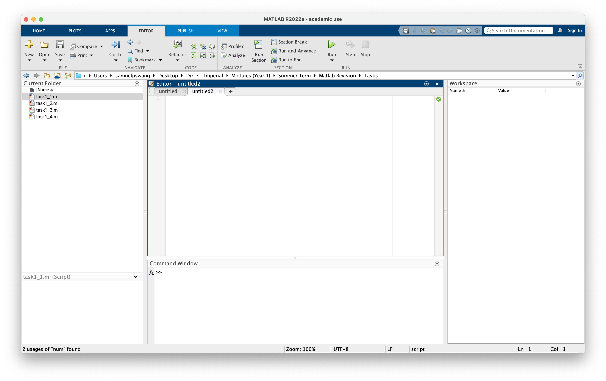

# MATLAB Cheat Sheat

- [MATLAB Cheat Sheat](#matlab-cheat-sheat)
  - [MATLAB Interface (R2022a)](#matlab-interface-r2022a)
    - [FAQ](#faq)
    - [Windows](#windows)
  - [Useful Commands](#useful-commands)
    - [Clearing History](#clearing-history)
  - [Language Basics](#language-basics)
    - [Comments/Breaking Lines](#commentsbreaking-lines)
    - [Types](#types)
    - [Conditionals](#conditionals)
    - [Loops](#loops)
    - [Print TODO:](#print-todo)
  - [Math](#math)
    - [Constants](#constants)
    - [Complex Numbers](#complex-numbers)
    - [Trigonometry Functions](#trigonometry-functions)
  - [Matrix/Array](#matrixarray)
    - [Declaration](#declaration)
    - [Basic Operation](#basic-operation)
  - [Data Visualization](#data-visualization)
    - [Scatter Plots](#scatter-plots)
  - [References](#references)

## MATLAB Interface (R2022a)

### FAQ

| Questions | Answers |
| --- | --- |
| How do I reset the interface to default layout? | Go to Command Window > Home > Layout > Default Layout |

### Windows

| Startup |
| --- |
|  |

| Command Window |
| --- |
|  |

| Editor|
| --- |
|  |

## Useful Commands

### Clearing History

| Item | Command |
| --- | --- |
| Clear All Variables | `clear all` |
| Clear Command Window | `clc` |
| Close All Windows | `close all` |

## Language Basics

### Comments/Breaking Lines

| Item | Syntax |
| --- | --- |
| Single-line Comment | `% comment` |
| Multi-line Comment | `%{ comment %}` |
| Break Line | `code ... code` |

```matlab
% This is a single-line comment in MATLAB.

%{
This is a multi-line comment. 
It spans two lines.
%}

% Break Line
x = x + ...
        123 - 456 * 789;
```

### Types

| Item |
| --- |
| Numbers |
| Booleans |
| Char, Char Arrays, Strings |

### Conditionals

| Item | Syntax |
| --- | --- |
| If, ElseIf, Else | `if condition` ... `elseif condition` ... `else` ... `end`|

```matlab
% If, Elseif, Else
if x = 1
  disp('x = 1');
elseif x = 2
  disp('x = 2');
else
  disp('x != 1 && x != 2');
end
```

### Loops

| Item | Syntax |
| --- | --- |
| For Loop (Increment=1) | `for variable = start:end` ... `end` |
| For Loop (Increment!=1) | `for variable = start:increment:end` ... `end` |
| While Loop | `while condition` ... `end` |

```matlab
% For (Increment=1)
for index = 1:3
    disp(index);
end

% For (Increment!=1)
for index = 5:-1:1
    disp(index);
end

% While
while index != 5
  index = index + 1;
end
```

### Print TODO:

- Display In Console
  - `disp(<something>)`

    ```matlab
    disp('display function');
    disp([1, 2, 3, 4]);
    ```

- Print As String
  - `sprintf(<print-format-string>, <variable1> ...)`
  - Takes an C-styled print format string and variables to be inserted.
  - Returns an array with formatted string and error message, use array with variables to catch result, such as: `[str, err]`.

    ```matlab
    print_string = 'x = %d';
    [string, err_msg] = sprintf(print_string, 1);
    ```

- Print To File
  - `fprintf(<print-format-string>, <variable1> ...)`
  - Display in command line, same as `disp` command.
  - Takes an C-styled print format string and variables to be inserted.

    ```matlab
    fprintf('x = %d', 1);
    ```

- C-Style Printing Statements
  - Basic Variables Used
    - Single char: `%c`
    - String: `%s`
    - Signed integer: `%d`
    - Floating point or double: `%f`

  - Floating Point Options
    - Specify number of digits before and after decimal point with `#.#`. For example: `%4.4f`.
    - Specify printing plus or minus signs with `+`. For example: `%+.2f`.

## Math

### Constants

| Item | Syntax |
| --- | --- |
| pi | `pi` |
| e | `exp(power)` |

### Complex Numbers

| Item | Syntax |
| --- | --- |
| Declaration | `variable = real + imaginary * 1i` |
| Real Part | `real(variable)` |
| Imaginary Part | `imag(variable)` |
| Modulus | `abs(variable)` |
| Phase Angle | `angle(variable)` |

- Use `1i` instead `i` or `j` (otherwise will get warning).
- Arithmetic operations work as usual on complex numbers.

### Trigonometry Functions

| Items | Syntax |
| --- | --- |
| Sine | `sin(radian)` |
| Cosine | `cos(radian)` |
| Tangent | `tan(radian)` |
| Arcsine | `asin(radian)` |
| Arccosine | `acos(radian)` |
| Arctangent | `atan(radian)` |
| Hyperbolic Sine | `sinh(radian)` |
| Hyperbolic Cosine | `cosh(radian)` |
| Hyperbolic Tangent | `tanh(radian)` |

## Matrix/Array

### Declaration

| Item | Syntax |
| --- | --- |
| Declaration | `variable = [ r1c1, r1c2, ...; r2c1, r2c2, ...; ... ]` |
| Linear Space | `linspace(start, end, number-of-points)` |

### Basic Operation

| Item | Syntax |
| --- | --- |
| Get Element | `variable(row, column)` |
| Get Row | `variable(row)` |
| Get Transpose |  `variable'` |

## Data Visualization

### Scatter Plots

## References

- MATLAB Official Documentation
  ([https://uk.mathworks.com/help/matlab/index.html](https://uk.mathworks.com/help/matlab/index.html))
- Imperial College Electrical & Electronics Engineering Department MATLAB Self-Revision Course
  ([https://www.imperial.ac.uk/electrical-engineering](https://www.imperial.ac.uk/electrical-engineering))
